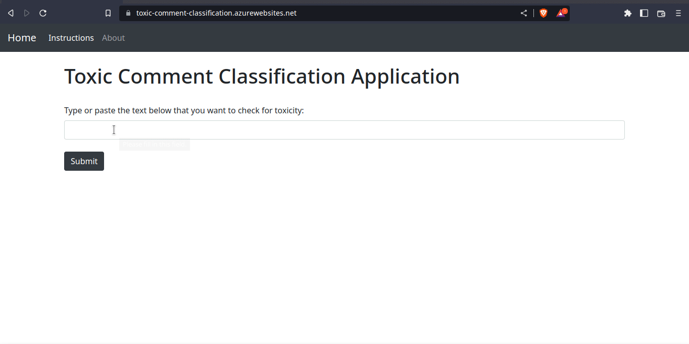

# Toxic Comment detection and classification web application using LSTM in PyTorch

Hate comments have become a common occuring in the online world. This project demonstrates the development of a deep learning model that can automatically detect the presence of toxicity and then classify it into six categories. The deep learning model consists of an input embedding layer followed by two LSTM layers and a dense layer with six units as the output layer with sigmoid activation since it is a multi-label classification task. The entire model has been written and trained in PyTorch on the [Jigsaw Toxic Comment Classification Challenge](https://www.kaggle.com/c/jigsaw-toxic-comment-classification-challenge) dataset available on [kaggle.com](https://kaggle.com). The dataset contains comments and their corresponding six labels corresponding to the categories viz. toxic, severe_toxic, obscene, threat, insult and identity_hate. Finally, a web application is created over the trained model using flask, Apache http server and containerized using docker. 

Click [here](https://toxic-comment-classification.azurewebsites.net/) to view the web application.